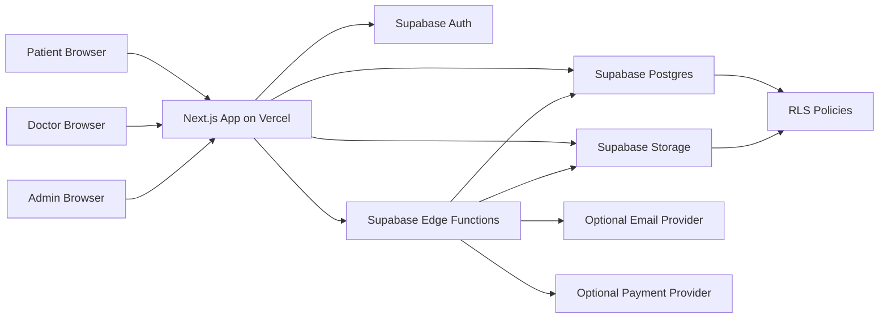

# Mental Health Booking Platform — Product & Architecture Reference

**Project type:** Web application  
**Stack:** Next.js + TypeScript + Tailwind CSS + shadcn/ui + Supabase + Vercel  
**Backend:** Supabase Postgres, Supabase Auth, Row Level Security, Supabase Storage, Supabase Edge Functions  
**Frontend:** Next.js App Router deployed on Vercel  
**Primary users:** Patients, Psychologists / Therapists, Admin  
**Document purpose:** This is the fixed reference document for building the full project with an AI coding assistant. The AI should follow this document as the source of truth.

---

## 1. Project Summary

The project is a mental health appointment booking platform that connects patients with licensed psychologists / therapists.

Patients can browse doctors, view doctor profiles, see available time slots, create an account, accept consent terms, and book a session. Psychologists can manage their profile, availability, appointments, and private session notes. Admins can verify doctors, manage users, monitor bookings, and handle platform settings.

The MVP should focus on a clear and secure booking workflow, not on advanced medical features. The system must not provide emergency care, automated diagnosis, or medical advice. It is a booking and practice-management platform.

---

## 2. Main Goals

1. Allow patients to find a suitable psychologist.
2. Allow patients to book appointments online.
3. Allow psychologists to manage availability and appointments.
4. Allow admins to verify doctors and manage the platform.
5. Protect sensitive mental health data using Supabase RLS and secure architecture.
6. Make the system easy to deploy on Vercel.
7. Keep the MVP simple enough to build quickly, but structured enough to scale later.

---

## 3. Non-Goals for MVP

The MVP should not include the following unless added later:

- No AI diagnosis.
- No emergency crisis management system.
- No prescription management.
- No advanced electronic health record system.
- No insurance claims.
- No complex hospital ERP features.
- No real-time video platform built from scratch.
- No public display of private patient information.
- No public doctor notes.
- No patient-to-patient community features.

---

## 4. Important Healthcare & Safety Disclaimer

Because this project deals with mental health data, the platform must include a clear disclaimer:

> This platform is not an emergency service. If you are in immediate danger, experiencing suicidal thoughts, or facing a medical emergency, contact your local emergency number or go to the nearest emergency department.

The platform should also include:

- Informed consent before booking the first session.
- Clear privacy policy.
- Clear cancellation and refund policy.
- Emergency contact field during patient onboarding.
- Doctor license verification before public listing.
- Secure access control for session notes and patient data.
- Audit logs for sensitive admin and doctor actions.

---

## 5. User Roles

### 5.1 Visitor

A visitor is not logged in.

Visitor can:

- View homepage.
- Browse public doctor directory.
- Filter doctors by specialty, language, session type, price, gender, and availability.
- View public doctor profile.
- Read platform pages: About, Privacy Policy, Terms, Emergency Disclaimer.
- Register or login.

Visitor cannot:

- Book appointments.
- View private doctor availability management.
- Send messages.
- View patient dashboard.
- View doctor dashboard.

---

### 5.2 Patient

A patient is a logged-in user who wants to book therapy sessions.

Patient can:

- Complete patient profile.
- Browse doctors.
- View doctor details.
- View available slots.
- Book an appointment.
- Cancel or reschedule appointment according to policy.
- View appointment history.
- View upcoming appointment details.
- Join online session link if provided.
- Add basic notes before the session.
- Submit a review after a completed session.
- Manage account settings.
- Request account deletion.
- Download or request personal data export if required later.

Patient cannot:

- View other patients.
- View doctor private notes.
- View admin dashboard.
- Book overlapping appointments.
- Book with an unverified doctor.
- Access another patient appointment.

---

### 5.3 Psychologist / Therapist / Doctor

A doctor is a logged-in provider account.

Doctor can:

- Complete professional profile.
- Upload profile image and license documents.
- Add specialties.
- Add languages.
- Set session types: online, in-person, or both.
- Set session price.
- Set weekly availability.
- Add time off / blocked dates.
- View own appointments.
- Accept, reject, or complete appointments depending on workflow.
- Add private session notes.
- View patient details only for patients who booked with them.
- Add session link for online sessions.
- Update profile visibility.
- View own reviews.

Doctor cannot:

- View patients who never booked with them.
- View other doctors’ appointments.
- Modify admin verification status.
- Access platform-wide analytics.
- Delete audit logs.
- Access service role key.
- View private patient data outside authorized appointments.

---

### 5.4 Admin

Admin manages the platform.

Admin can:

- View all users.
- Verify or reject doctor applications.
- Suspend users.
- Manage specialties.
- Manage platform settings.
- View appointment overview.
- Handle reports and support tickets.
- View audit logs.
- Manage featured doctors.
- Review uploaded license documents.
- Manage cancellation policy content.
- Manage static pages.

Admin should have restricted access to clinical session notes. By default, admin should not read doctor private notes unless a legal or safety process requires it. For MVP, keep admin away from session notes.

---

## 6. Recommended MVP Scope

Build these features first:

### Public Website

- Landing page.
- Doctor directory.
- Doctor profile page.
- Search and filters.
- About page.
- Contact page.
- Terms page.
- Privacy page.
- Emergency disclaimer page.

### Authentication

- Email/password login.
- Email verification.
- Forgot password.
- Role-based redirect after login.
- Profile onboarding after signup.

### Patient Features

- Patient dashboard.
- Edit patient profile.
- Book appointment.
- View upcoming appointments.
- View past appointments.
- Cancel appointment.
- Basic appointment details page.
- Consent acceptance before first booking.

### Doctor Features

- Doctor dashboard.
- Edit public profile.
- Upload profile image.
- Upload license document.
- Manage weekly availability.
- Manage time off.
- View appointments.
- Confirm / reject appointment if manual confirmation is enabled.
- Add private session notes.
- Mark appointment as completed.

### Admin Features

- Admin dashboard.
- Doctor verification queue.
- User management.
- Specialties management.
- Appointment overview.
- Support tickets.
- Audit logs.

### Notifications

For MVP:

- In-app notifications table.
- Email notification integration can be added later using Resend, SendGrid, or Supabase Edge Functions.

---

## 7. Future Features

These can be added after MVP:

- Online payments using Stripe, Paymob, or another provider.
- Coupon codes.
- Doctor subscription plans.
- Patient-doctor chat.
- Video session integration.
- Google Calendar integration.
- Doctor analytics.
- Automated reminders.
- Multi-language support: English and Arabic.
- Mobile app.
- Blog / mental health resources.
- AI assistant for administrative support only, not diagnosis.
- Patient intake forms.
- Clinical document upload.
- Organization / clinic accounts.
- Multiple branches.
- Group sessions.
- Doctor payout management.

---

## 8. High-Level Architecture



### Architecture Explanation

- Next.js handles UI, routing, server components, server actions, and dashboard pages.
- Supabase Auth handles login, signup, sessions, and user identity.
- Supabase Postgres stores all structured data.
- Supabase RLS is the main authorization layer.
- Supabase Storage stores profile images and doctor license documents.
- Supabase Edge Functions handle sensitive operations such as booking creation, doctor verification, payment webhooks, and notification sending.
- Vercel hosts the frontend and stores deployment environment variables.
- The frontend must never use the Supabase service role key.

---

## 9. Core User Journey

### 9.1 Patient Booking Journey

1. Visitor opens homepage.
2. Visitor clicks “Find a Therapist”.
3. Visitor filters doctors by specialty, price, language, gender, and session type.
4. Visitor opens doctor profile.
5. Visitor selects a date and time slot.
6. If not logged in, visitor is redirected to login/signup.
7. Patient completes profile if not completed.
8. Patient accepts informed consent and emergency disclaimer if this is first booking.
9. Patient confirms booking.
10. System creates appointment.
11. Appointment status becomes:
    - `pending_confirmation` if doctor must approve.
    - `confirmed` if auto-confirm is enabled.
12. Patient sees appointment in dashboard.
13. Doctor sees appointment in doctor dashboard.
14. Notification is created for patient and doctor.
15. Doctor completes appointment after session.
16. Patient may leave a review.

---

### 9.2 Doctor Onboarding Journey

1. Doctor signs up.
2. Doctor chooses role: doctor.
3. Doctor completes professional profile.
4. Doctor uploads license document.
5. Doctor adds specialties, languages, price, bio, session type.
6. Doctor sets weekly availability.
7. Doctor profile status is `pending_verification`.
8. Admin reviews doctor data and documents.
9. Admin approves or rejects.
10. If approved, doctor becomes publicly visible.
11. Patient can book with this doctor.

---

### 9.3 Admin Verification Journey

1. Admin logs in.
2. Admin opens doctor verification queue.
3. Admin reviews profile and license document.
4. Admin approves, rejects, or requests changes.
5. System writes audit log.
6. Doctor receives notification.
7. If approved, doctor appears in public directory.

---

## 10. Booking Logic

### 10.1 Appointment Statuses

Use a strict enum-like set:

```text
draft
pending_confirmation
confirmed
cancelled_by_patient
cancelled_by_doctor
rejected_by_doctor
completed
no_show
rescheduled
```

### 10.2 Session Types

```text
online
in_person
```

### 10.3 Booking Rules

- Patient must be authenticated.
- Patient profile must be completed.
- Doctor must be verified and active.
- Doctor must be available in selected time.
- Selected time must not overlap with existing active appointments.
- Appointment start time must be in the future.
- Appointment must respect doctor session duration.
- Appointment cannot be created if doctor is suspended.
- Appointment cannot be created if patient is suspended.
- Patient must accept consent before first booking.
- System must prevent double booking using database-level constraints, not frontend validation only.

### 10.4 Cancellation Rules

Recommended MVP policy:

- Patient can cancel more than 24 hours before appointment.
- Patient cannot cancel less than 24 hours before appointment unless admin allows it.
- Doctor can cancel but must provide reason.
- Every cancellation should create appointment status history.
- Every cancellation should create notification.

### 10.5 Rescheduling Rules

For MVP, rescheduling can be implemented as:

1. Cancel old appointment.
2. Create new appointment.
3. Link both records using `rescheduled_from_appointment_id`.

This is simpler than modifying appointment time directly.

---

## 11. Database Design

Use Supabase Postgres.

Important:

- Every table in `public` must have RLS enabled.
- Use `uuid` primary keys.
- Use `created_at` and `updated_at`.
- Use `created_by` where useful.
- Store role in `profiles.role`, not only in frontend state.
- Never expose service role key in frontend.
- Keep sensitive notes separate from general appointments.

---

## 12. Database Tables

### 12.1 `profiles`

Stores common data for all users.

```sql
create table public.profiles (
  id uuid primary key references auth.users(id) on delete cascade,
  role text not null check (role in ('patient', 'doctor', 'admin')),
  full_name text not null,
  email text not null,
  phone text,
  avatar_url text,
  status text not null default 'active' check (status in ('active', 'suspended', 'deleted')),
  onboarding_completed boolean not null default false,
  created_at timestamptz not null default now(),
  updated_at timestamptz not null default now()
);
```

---

### 12.2 `patient_profiles`

Stores patient-specific data.

```sql
create table public.patient_profiles (
  id uuid primary key default gen_random_uuid(),
  user_id uuid not null unique references public.profiles(id) on delete cascade,
  date_of_birth date,
  gender text check (gender in ('male', 'female', 'other', 'prefer_not_to_say')),
  emergency_contact_name text,
  emergency_contact_phone text,
  emergency_contact_relationship text,
  preferred_language text,
  consent_completed boolean not null default false,
  consent_completed_at timestamptz,
  created_at timestamptz not null default now(),
  updated_at timestamptz not null default now()
);
```

Notes:

- Emergency contact is important for mental health platforms.
- Do not ask for too much sensitive information in MVP.
- Make sensitive intake questions optional.

---

### 12.3 `doctor_profiles`

Stores doctor-specific data.

```sql
create table public.doctor_profiles (
  id uuid primary key default gen_random_uuid(),
  user_id uuid not null unique references public.profiles(id) on delete cascade,
  public_slug text unique,
  title text,
  bio text,
  years_experience int default 0,
  license_number text,
  license_document_url text,
  verification_status text not null default 'pending'
    check (verification_status in ('pending', 'approved', 'rejected', 'changes_requested')),
  verified_at timestamptz,
  verified_by uuid references public.profiles(id),
  session_duration_minutes int not null default 50,
  online_session_price numeric(10,2),
  in_person_session_price numeric(10,2),
  offers_online boolean not null default true,
  offers_in_person boolean not null default false,
  clinic_address text,
  city text,
  country text default 'Egypt',
  gender text check (gender in ('male', 'female', 'other', 'prefer_not_to_say')),
  is_public boolean not null default false,
  auto_confirm_bookings boolean not null default true,
  created_at timestamptz not null default now(),
  updated_at timestamptz not null default now()
);
```

---

### 12.4 `specialties`

```sql
create table public.specialties (
  id uuid primary key default gen_random_uuid(),
  name text not null unique,
  slug text not null unique,
  description text,
  is_active boolean not null default true,
  created_at timestamptz not null default now()
);
```

Recommended default specialties:

- Anxiety
- Depression
- Stress Management
- Relationship Issues
- Family Counseling
- Trauma
- Addiction Support
- Child & Adolescent Therapy
- Grief
- Self-Esteem
- Work Burnout
- Anger Management

---

### 12.5 `doctor_specialties`

```sql
create table public.doctor_specialties (
  doctor_id uuid not null references public.doctor_profiles(id) on delete cascade,
  specialty_id uuid not null references public.specialties(id) on delete cascade,
  primary key (doctor_id, specialty_id)
);
```

---

### 12.6 `doctor_languages`

```sql
create table public.doctor_languages (
  id uuid primary key default gen_random_uuid(),
  doctor_id uuid not null references public.doctor_profiles(id) on delete cascade,
  language text not null,
  unique (doctor_id, language)
);
```

Recommended languages:

- Arabic
- English
- French
- German

---

### 12.7 `doctor_availability_rules`

Stores weekly recurring availability.

```sql
create table public.doctor_availability_rules (
  id uuid primary key default gen_random_uuid(),
  doctor_id uuid not null references public.doctor_profiles(id) on delete cascade,
  day_of_week int not null check (day_of_week between 0 and 6),
  start_time time not null,
  end_time time not null,
  session_type text not null check (session_type in ('online', 'in_person')),
  is_active boolean not null default true,
  created_at timestamptz not null default now(),
  check (start_time < end_time)
);
```

Day mapping:

```text
0 = Sunday
1 = Monday
2 = Tuesday
3 = Wednesday
4 = Thursday
5 = Friday
6 = Saturday
```

---

### 12.8 `doctor_time_off`

Stores blocked dates or vacations.

```sql
create table public.doctor_time_off (
  id uuid primary key default gen_random_uuid(),
  doctor_id uuid not null references public.doctor_profiles(id) on delete cascade,
  start_at timestamptz not null,
  end_at timestamptz not null,
  reason text,
  created_at timestamptz not null default now(),
  check (start_at < end_at)
);
```

---

### 12.9 `appointments`

```sql
create table public.appointments (
  id uuid primary key default gen_random_uuid(),
  patient_id uuid not null references public.profiles(id),
  doctor_id uuid not null references public.doctor_profiles(id),
  scheduled_start timestamptz not null,
  scheduled_end timestamptz not null,
  session_type text not null check (session_type in ('online', 'in_person')),
  status text not null default 'pending_confirmation'
    check (status in (
      'draft',
      'pending_confirmation',
      'confirmed',
      'cancelled_by_patient',
      'cancelled_by_doctor',
      'rejected_by_doctor',
      'completed',
      'no_show',
      'rescheduled'
    )),
  patient_message text,
  cancellation_reason text,
  rejection_reason text,
  meeting_url text,
  location_snapshot text,
  price_snapshot numeric(10,2),
  currency text not null default 'EGP',
  rescheduled_from_appointment_id uuid references public.appointments(id),
  created_at timestamptz not null default now(),
  updated_at timestamptz not null default now(),
  check (scheduled_start < scheduled_end)
);
```

Important:

- `price_snapshot` stores the price at booking time.
- `location_snapshot` stores the clinic address at booking time.
- Do not depend only on current doctor profile price/address because they may change later.

---

### 12.10 Prevent Double Booking

Recommended Postgres exclusion constraint:

```sql
create extension if not exists btree_gist;

alter table public.appointments
add column appointment_range tstzrange
generated always as (tstzrange(scheduled_start, scheduled_end, '[)')) stored;

alter table public.appointments
add constraint no_overlapping_active_doctor_appointments
exclude using gist (
  doctor_id with =,
  appointment_range with &&
)
where (status in ('pending_confirmation', 'confirmed'));
```

This prevents a doctor from having two active appointments at overlapping times.

---

### 12.11 `appointment_status_history`

```sql
create table public.appointment_status_history (
  id uuid primary key default gen_random_uuid(),
  appointment_id uuid not null references public.appointments(id) on delete cascade,
  old_status text,
  new_status text not null,
  changed_by uuid references public.profiles(id),
  reason text,
  created_at timestamptz not null default now()
);
```

---

### 12.12 `session_notes`

Private doctor notes.

```sql
create table public.session_notes (
  id uuid primary key default gen_random_uuid(),
  appointment_id uuid not null unique references public.appointments(id) on delete cascade,
  doctor_id uuid not null references public.doctor_profiles(id),
  patient_id uuid not null references public.profiles(id),
  note_text text not null,
  risk_level text check (risk_level in ('low', 'medium', 'high')),
  follow_up_recommended boolean default false,
  created_at timestamptz not null default now(),
  updated_at timestamptz not null default now()
);
```

Rules:

- Only the doctor who owns the appointment can view and edit the note.
- Patient cannot view this table.
- Admin should not view this table in MVP.
- Do not store unnecessary sensitive details.

---

### 12.13 `consent_records`

```sql
create table public.consent_records (
  id uuid primary key default gen_random_uuid(),
  patient_id uuid not null references public.profiles(id),
  consent_type text not null check (consent_type in ('general_terms', 'telehealth', 'privacy', 'emergency_disclaimer')),
  version text not null,
  accepted_at timestamptz not null default now(),
  ip_address text,
  user_agent text,
  created_at timestamptz not null default now()
);
```

Use this to prove that the patient accepted key policies.

---

### 12.14 `reviews`

```sql
create table public.reviews (
  id uuid primary key default gen_random_uuid(),
  appointment_id uuid not null unique references public.appointments(id) on delete cascade,
  patient_id uuid not null references public.profiles(id),
  doctor_id uuid not null references public.doctor_profiles(id),
  rating int not null check (rating between 1 and 5),
  comment text,
  status text not null default 'published' check (status in ('published', 'hidden', 'reported')),
  created_at timestamptz not null default now()
);
```

Rules:

- Patient can review only completed appointments.
- Patient can review each appointment once.
- Doctor cannot edit reviews.
- Admin can hide inappropriate reviews.

---

### 12.15 `notifications`

```sql
create table public.notifications (
  id uuid primary key default gen_random_uuid(),
  user_id uuid not null references public.profiles(id) on delete cascade,
  title text not null,
  body text not null,
  type text not null,
  read_at timestamptz,
  created_at timestamptz not null default now()
);
```

Notification types:

```text
appointment_created
appointment_confirmed
appointment_cancelled
appointment_rejected
appointment_completed
doctor_verified
doctor_rejected
support_reply
```

---

### 12.16 `support_tickets`

```sql
create table public.support_tickets (
  id uuid primary key default gen_random_uuid(),
  user_id uuid references public.profiles(id),
  subject text not null,
  message text not null,
  status text not null default 'open' check (status in ('open', 'in_progress', 'closed')),
  created_at timestamptz not null default now(),
  updated_at timestamptz not null default now()
);
```

---

### 12.17 `audit_logs`

```sql
create table public.audit_logs (
  id uuid primary key default gen_random_uuid(),
  actor_id uuid references public.profiles(id),
  action text not null,
  entity_type text not null,
  entity_id uuid,
  metadata jsonb default '{}'::jsonb,
  created_at timestamptz not null default now()
);
```

Examples:

```text
doctor_verified
doctor_rejected
appointment_cancelled_by_admin
user_suspended
profile_updated
license_document_viewed
```

Audit logs should be append-only. Do not allow normal users to update or delete them.

---

### 12.18 `platform_settings`

```sql
create table public.platform_settings (
  key text primary key,
  value jsonb not null,
  updated_by uuid references public.profiles(id),
  updated_at timestamptz not null default now()
);
```

Examples:

```json
{
  "booking_cancellation_hours": 24,
  "default_currency": "EGP",
  "manual_doctor_approval": true,
  "support_email": "support@example.com"
}
```

---

## 13. RLS Security Model

### 13.1 General RLS Rules

- Enable RLS on every public table.
- Public read access is allowed only for approved public doctor data and active specialties.
- Patients can read and update only their own profile.
- Doctors can read and update only their own doctor profile.
- Doctors can read appointments assigned to them.
- Patients can read appointments created by them.
- Admins can manage platform data.
- Session notes are visible only to the assigned doctor.
- Storage files must also have policies.

---

### 13.2 Helper Function: Current User Role

Create a helper function:

```sql
create or replace function public.current_user_role()
returns text
language sql
security definer
set search_path = public
as $$
  select role from public.profiles where id = auth.uid();
$$;
```

Use it in policies:

```sql
public.current_user_role() = 'admin'
```

---

### 13.3 Example RLS Policies

#### Profiles

```sql
alter table public.profiles enable row level security;

create policy "Users can view own profile"
on public.profiles
for select
using (id = auth.uid());

create policy "Users can update own profile"
on public.profiles
for update
using (id = auth.uid())
with check (id = auth.uid());

create policy "Admins can view all profiles"
on public.profiles
for select
using (public.current_user_role() = 'admin');
```

#### Public Doctor Profiles

```sql
alter table public.doctor_profiles enable row level security;

create policy "Anyone can view approved public doctors"
on public.doctor_profiles
for select
using (
  verification_status = 'approved'
  and is_public = true
);

create policy "Doctors can view own doctor profile"
on public.doctor_profiles
for select
using (user_id = auth.uid());

create policy "Doctors can update own unverified profile fields"
on public.doctor_profiles
for update
using (user_id = auth.uid())
with check (user_id = auth.uid());

create policy "Admins can manage doctor profiles"
on public.doctor_profiles
for all
using (public.current_user_role() = 'admin')
with check (public.current_user_role() = 'admin');
```

#### Appointments

```sql
alter table public.appointments enable row level security;

create policy "Patients can view own appointments"
on public.appointments
for select
using (patient_id = auth.uid());

create policy "Doctors can view own appointments"
on public.appointments
for select
using (
  doctor_id in (
    select id from public.doctor_profiles where user_id = auth.uid()
  )
);

create policy "Admins can view all appointments"
on public.appointments
for select
using (public.current_user_role() = 'admin');
```

Important:

- Appointment creation should preferably happen through an Edge Function or RPC to avoid double booking and to validate all rules.
- Do not allow direct frontend insert into appointments unless the RLS and database constraints are extremely strict.

---

## 14. Supabase Storage Design

Recommended buckets:

```text
avatars
doctor-licenses
doctor-gallery
support-attachments
```

### 14.1 Bucket Access

#### `avatars`

- Public read is acceptable for profile images.
- User can upload/update only their own avatar path.
- File path format: `avatars/{user_id}/avatar.png`

#### `doctor-licenses`

- Private bucket.
- Doctor can upload own document.
- Admin can view documents for verification.
- Public cannot access.
- Patient cannot access.

File path format:

```text
doctor-licenses/{doctor_user_id}/{document_id}.pdf
```

#### `support-attachments`

- Private bucket.
- Ticket owner and admin can access.

---

## 15. Edge Functions

Use Supabase Edge Functions for operations that need server-side trust, service role access, external integrations, or multi-step transactions.

### 15.1 `create-appointment`

Purpose:

- Validate patient.
- Validate doctor.
- Validate consent.
- Validate doctor availability.
- Validate no overlap.
- Create appointment.
- Create status history.
- Create notifications.

Input:

```json
{
  "doctor_id": "uuid",
  "scheduled_start": "2026-05-08T10:00:00+03:00",
  "session_type": "online",
  "patient_message": "I prefer anxiety-focused therapy."
}
```

Output:

```json
{
  "success": true,
  "appointment_id": "uuid",
  "status": "confirmed"
}
```

Errors:

```json
{
  "success": false,
  "code": "DOCTOR_NOT_AVAILABLE",
  "message": "The selected time slot is no longer available."
}
```

---

### 15.2 `cancel-appointment`

Purpose:

- Validate current user owns the appointment or is doctor/admin.
- Check cancellation policy.
- Change status.
- Add reason.
- Insert status history.
- Notify other party.

Input:

```json
{
  "appointment_id": "uuid",
  "reason": "Unexpected schedule conflict."
}
```

---

### 15.3 `verify-doctor`

Admin-only.

Purpose:

- Approve/reject doctor.
- Set `verification_status`.
- Set `is_public`.
- Write audit log.
- Notify doctor.

Input:

```json
{
  "doctor_profile_id": "uuid",
  "decision": "approved",
  "admin_note": "License verified."
}
```

---

### 15.4 `create-notification`

Internal function used by other functions.

Purpose:

- Create database notification.
- Optionally send email later.

---

### 15.5 `payment-webhook` — Future

Only needed when payments are added.

Purpose:

- Receive payment provider webhook.
- Verify signature.
- Update payment and appointment status.
- Never trust frontend payment confirmation.

---

## 16. Frontend Architecture

Use Next.js App Router.

Recommended folder structure:

```text
src/
  app/
    (public)/
      page.tsx
      doctors/
        page.tsx
        [slug]/
          page.tsx
      about/
        page.tsx
      contact/
        page.tsx
      privacy/
        page.tsx
      terms/
        page.tsx
      emergency/
        page.tsx

    (auth)/
      login/
        page.tsx
      register/
        page.tsx
      forgot-password/
        page.tsx
      reset-password/
        page.tsx

    (patient)/
      patient/
        dashboard/
          page.tsx
        appointments/
          page.tsx
          [id]/
            page.tsx
        profile/
          page.tsx
        consent/
          page.tsx

    (doctor)/
      doctor/
        dashboard/
          page.tsx
        profile/
          page.tsx
        availability/
          page.tsx
        appointments/
          page.tsx
          [id]/
            page.tsx
        notes/
          [appointmentId]/
            page.tsx

    (admin)/
      admin/
        dashboard/
          page.tsx
        doctors/
          page.tsx
          [id]/
            page.tsx
        users/
          page.tsx
        appointments/
          page.tsx
        specialties/
          page.tsx
        settings/
          page.tsx
        audit-logs/
          page.tsx

  components/
    ui/
    layout/
    doctors/
    booking/
    appointments/
    dashboards/
    forms/
    shared/

  lib/
    supabase/
      client.ts
      server.ts
      middleware.ts
    validations/
    utils.ts
    constants.ts

  types/
    database.ts
    app.ts
```

---

## 17. Frontend Pages

### 17.1 Public Home Page

Sections:

- Hero: “Find trusted mental health support.”
- Search bar.
- Featured doctors.
- How it works.
- Safety and privacy promise.
- CTA: Find a therapist.
- CTA: Join as psychologist.
- Footer.

---

### 17.2 Doctor Directory Page

Path:

```text
/doctors
```

Features:

- Search by name.
- Filter by specialty.
- Filter by language.
- Filter by session type.
- Filter by city.
- Filter by price range.
- Filter by gender.
- Sort by:
  - Recommended
  - Price low to high
  - Experience
  - Rating
  - Next available

Doctor card should show:

- Image.
- Name.
- Title.
- Specialties.
- Languages.
- Years of experience.
- Starting price.
- Online/in-person badges.
- Rating.
- Next available slot if possible.
- “View profile” button.

---

### 17.3 Doctor Profile Page

Path:

```text
/doctors/[slug]
```

Sections:

- Doctor header.
- Bio.
- Specialties.
- Languages.
- Experience.
- Session types.
- Prices.
- Location if in-person.
- Availability calendar.
- Reviews.
- Book appointment CTA.

Booking widget:

- Select session type.
- Select date.
- Select slot.
- Confirm booking.

---

### 17.4 Patient Dashboard

Path:

```text
/patient/dashboard
```

Cards:

- Upcoming appointment.
- Recommended doctors.
- Profile completion.
- Consent status.
- Recent appointments.

---

### 17.5 Patient Appointments

Path:

```text
/patient/appointments
```

Tabs:

- Upcoming.
- Past.
- Cancelled.

Each appointment card:

- Doctor name.
- Date/time.
- Status.
- Session type.
- Join link if online and confirmed.
- Cancel button if allowed.
- Review button if completed.

---

### 17.6 Doctor Dashboard

Path:

```text
/doctor/dashboard
```

Cards:

- Today’s appointments.
- Upcoming appointments.
- Pending confirmations.
- Profile verification status.
- Profile completion.
- Availability status.

---

### 17.7 Doctor Availability Page

Path:

```text
/doctor/availability
```

Features:

- Weekly schedule editor.
- Add availability block.
- Remove availability block.
- Add time off.
- View generated slots preview.

---

### 17.8 Admin Dashboard

Path:

```text
/admin/dashboard
```

Cards:

- Total users.
- Total doctors.
- Pending doctor verifications.
- Today’s appointments.
- Open support tickets.
- Recent audit logs.

---

## 18. Components

Recommended components:

```text
DoctorCard
DoctorFilters
DoctorProfileHeader
AvailabilityCalendar
TimeSlotPicker
BookingConfirmationDialog
ConsentCheckboxGroup
AppointmentCard
AppointmentStatusBadge
DashboardStatCard
ProfileCompletionCard
DoctorVerificationCard
AdminSidebar
PatientSidebar
DoctorSidebar
RoleBasedNavbar
EmergencyDisclaimerBanner
```

---

## 19. Form Validation

Use Zod for validation.

### Patient Profile Validation

Required:

- Full name.
- Phone.
- Emergency contact name.
- Emergency contact phone.

Optional:

- Date of birth.
- Gender.
- Preferred language.

### Doctor Profile Validation

Required:

- Full name.
- Title.
- Bio.
- License number.
- At least one specialty.
- At least one language.
- Session duration.
- At least one session type.
- Price for enabled session type.
- License document upload.

### Appointment Validation

Required:

- Doctor ID.
- Scheduled start.
- Session type.
- Consent accepted.

---

## 20. Authentication & Authorization Flow

### 20.1 Signup

User chooses:

```text
I am a Patient
I am a Psychologist
```

After signup:

- Create row in `profiles`.
- If patient, create row in `patient_profiles`.
- If doctor, create row in `doctor_profiles`.
- Redirect to role-specific onboarding.

### 20.2 Login Redirect

After login:

```text
admin -> /admin/dashboard
doctor -> /doctor/dashboard
patient -> /patient/dashboard
```

### 20.3 Middleware Protection

Middleware should:

- Check session.
- Redirect unauthenticated users to `/login`.
- Prevent patient from accessing doctor/admin pages.
- Prevent doctor from accessing admin pages.
- Prevent suspended users from dashboards.

---

## 21. Environment Variables

Use `.env.local` for development and Vercel environment variables for production.

```env
NEXT_PUBLIC_SUPABASE_URL=
NEXT_PUBLIC_SUPABASE_ANON_KEY=

SUPABASE_SERVICE_ROLE_KEY=

NEXT_PUBLIC_SITE_URL=http://localhost:3000

EMAIL_PROVIDER_API_KEY=
EMAIL_FROM=

PAYMENT_PROVIDER_SECRET=
PAYMENT_WEBHOOK_SECRET=
```

Rules:

- `NEXT_PUBLIC_SUPABASE_URL` and `NEXT_PUBLIC_SUPABASE_ANON_KEY` can be used in browser.
- `SUPABASE_SERVICE_ROLE_KEY` must never be used in client components.
- Service role key only belongs in Edge Functions or protected server-side code.
- Never commit `.env.local`.
- Add `.env.example` to repo.

---

## 22. Security Requirements

### 22.1 Application Security

- Enable RLS on all public tables.
- Use strict RLS policies.
- Use server-side validation.
- Use Zod validation.
- Prevent double booking at database level.
- Do not expose service role key.
- Keep private buckets private.
- Sanitize user-generated text.
- Add rate limiting later for auth and booking actions.
- Use audit logs for admin actions.
- Use least privilege access model.
- Add secure error messages without leaking sensitive data.

### 22.2 Healthcare Data Safety

- Collect minimum necessary data.
- Keep session notes private.
- Do not show doctor notes to patients in MVP.
- Do not allow admin to casually browse clinical notes.
- Add consent records.
- Add emergency disclaimer.
- Add account deletion request process.
- Add data export request process later.
- Keep license documents private.
- Avoid storing unnecessary diagnosis labels in MVP.

### 22.3 Production Checklist

Before going live:

- Confirm RLS is enabled on all tables.
- Test every role manually.
- Test unauthorized access.
- Test direct Supabase queries from browser.
- Test private storage access.
- Test appointment double booking.
- Test doctor verification.
- Test cancellation rules.
- Add legal review for privacy, consent, and local health regulations.
- Configure backups.
- Configure error monitoring.
- Configure Vercel environment variables.
- Configure Supabase project security settings.
- Remove seed/test accounts.

---

## 23. Booking Slot Generation

Slot generation can be done in frontend or server, but final validation must happen on backend.

### Input

- Doctor availability rules.
- Doctor time off.
- Existing appointments.
- Session duration.
- Selected date.
- Session type.

### Algorithm

1. Get day of week from selected date.
2. Fetch active doctor availability rules for that day and session type.
3. Generate slots between `start_time` and `end_time`.
4. Remove slots that are in the past.
5. Remove slots overlapping doctor time off.
6. Remove slots overlapping pending/confirmed appointments.
7. Return remaining slots.

### Example

Doctor availability:

```text
Sunday 10:00 - 14:00
Session duration: 50 minutes
```

Generated slots:

```text
10:00 - 10:50
11:00 - 11:50
12:00 - 12:50
13:00 - 13:50
```

Add 10-minute buffer if needed.

---

## 24. API / Function Contracts

### 24.1 Public Doctor Search

Can be done via Supabase query or server route.

Request filters:

```ts
type DoctorSearchFilters = {
  search?: string;
  specialty?: string;
  language?: string;
  sessionType?: "online" | "in_person";
  city?: string;
  gender?: string;
  minPrice?: number;
  maxPrice?: number;
  sort?: "recommended" | "price_asc" | "experience_desc" | "rating_desc" | "next_available";
};
```

Response:

```ts
type DoctorSearchResult = {
  id: string;
  slug: string;
  fullName: string;
  title: string;
  avatarUrl: string | null;
  bioShort: string;
  specialties: string[];
  languages: string[];
  yearsExperience: number;
  offersOnline: boolean;
  offersInPerson: boolean;
  startingPrice: number | null;
  currency: string;
  ratingAverage: number | null;
  ratingCount: number;
};
```

---

### 24.2 Appointment Object

```ts
type AppointmentStatus =
  | "draft"
  | "pending_confirmation"
  | "confirmed"
  | "cancelled_by_patient"
  | "cancelled_by_doctor"
  | "rejected_by_doctor"
  | "completed"
  | "no_show"
  | "rescheduled";

type Appointment = {
  id: string;
  patientId: string;
  doctorId: string;
  scheduledStart: string;
  scheduledEnd: string;
  sessionType: "online" | "in_person";
  status: AppointmentStatus;
  patientMessage?: string;
  meetingUrl?: string;
  locationSnapshot?: string;
  priceSnapshot?: number;
  currency: "EGP" | "USD";
};
```

---

## 25. UI / UX Direction

Design style:

- Clean medical SaaS look.
- Calm colors.
- White background.
- Soft blue / teal / green accents.
- Rounded cards.
- Clear typography.
- Not childish.
- Not too dark.
- Trust-focused.
- Mobile responsive.

Recommended visual feel:

- Simple landing page.
- Professional doctor cards.
- Dashboard sidebars.
- Clear status badges.
- Minimal animation.
- High readability.

Suggested palette:

```text
Primary: #2563EB
Secondary: #0F766E
Background: #F8FAFC
Text: #0F172A
Muted: #64748B
Success: #16A34A
Warning: #F59E0B
Danger: #DC2626
```

---

## 26. Required Static Pages

### 26.1 Terms of Service

Must include:

- Platform role.
- Booking rules.
- Cancellation policy.
- No emergency service disclaimer.
- User responsibilities.
- Doctor responsibilities.
- Account suspension rules.
- Payment/refund rules if payments exist.

### 26.2 Privacy Policy

Must include:

- What data is collected.
- Why data is collected.
- Who can access data.
- Storage and security overview.
- User rights.
- Data deletion request.
- Contact email.
- Legal note to review with lawyer before production.

### 26.3 Emergency Disclaimer

Must clearly say:

- Platform is not for emergencies.
- If user is in danger, contact emergency services.
- Platform cannot guarantee instant doctor response.
- Online booking is not a crisis service.

### 26.4 Informed Consent

Should include:

- Nature of telehealth.
- Privacy limitations.
- Technical risks.
- Session limitations.
- Emergency contact.
- Right to stop using service.
- Patient responsibility to provide accurate information.
- Date/time of acceptance.

---

## 27. Admin Rules

Admin must be able to:

- Approve doctors.
- Reject doctors.
- Request changes.
- Suspend users.
- Hide reviews.
- Manage specialties.
- View support tickets.
- View audit logs.

Admin must not:

- Casually access private clinical session notes.
- Modify appointment history without audit log.
- Delete audit logs.
- Approve doctor without license review.
- Expose license documents publicly.

---

## 28. Error Handling

Use consistent error format:

```ts
type AppError = {
  code: string;
  message: string;
  details?: unknown;
};
```

Common error codes:

```text
UNAUTHENTICATED
UNAUTHORIZED
PROFILE_INCOMPLETE
CONSENT_REQUIRED
DOCTOR_NOT_FOUND
DOCTOR_NOT_VERIFIED
DOCTOR_NOT_AVAILABLE
SLOT_ALREADY_BOOKED
APPOINTMENT_NOT_FOUND
CANCELLATION_WINDOW_CLOSED
VALIDATION_ERROR
INTERNAL_ERROR
```

User-facing messages should be simple and safe.

Example:

```text
This time slot is no longer available. Please choose another time.
```

Do not show raw SQL errors to users.

---

## 29. Notifications

### Notification Events

- Appointment created.
- Appointment confirmed.
- Appointment rejected.
- Appointment cancelled.
- Appointment completed.
- Doctor verified.
- Doctor rejected.
- Doctor requested changes.
- Support ticket reply.

### MVP Delivery

- Store all notifications in database.
- Show notification bell in dashboard.

### Later

- Add email reminders.
- Add SMS / WhatsApp reminders.
- Add push notifications.

---

## 30. Testing Plan

### 30.1 Patient Tests

- Patient can sign up.
- Patient can complete profile.
- Patient can view doctors.
- Patient can book appointment.
- Patient cannot book without consent.
- Patient cannot book unavailable slot.
- Patient cannot view another patient’s appointment.
- Patient can cancel appointment if policy allows.
- Patient cannot access doctor dashboard.
- Patient cannot access admin dashboard.

### 30.2 Doctor Tests

- Doctor can sign up.
- Doctor can complete profile.
- Doctor can upload license.
- Doctor is not public before admin approval.
- Doctor can set availability.
- Doctor can view own appointments.
- Doctor cannot view other doctor appointments.
- Doctor can add notes only to own appointments.
- Doctor cannot access admin dashboard.

### 30.3 Admin Tests

- Admin can view pending doctors.
- Admin can approve doctor.
- Admin can reject doctor.
- Admin can suspend user.
- Admin can manage specialties.
- Admin can view audit logs.
- Admin action creates audit log.

### 30.4 Security Tests

- RLS blocks unauthorized rows.
- Private storage files are not publicly accessible.
- Service role key is not exposed.
- Browser cannot insert fake appointment for another patient.
- Browser cannot update doctor verification status.
- Double booking fails.
- Suspended user cannot book.

---

## 31. Suggested Development Roadmap

### Phase 1 — Setup

- Create Next.js app.
- Install Tailwind and shadcn/ui.
- Create Supabase project.
- Connect Supabase client.
- Add environment variables.
- Add basic layout.
- Add public pages.

### Phase 2 — Auth & Profiles

- Add signup/login.
- Add role selection.
- Create profiles tables.
- Add onboarding pages.
- Add dashboard redirect by role.
- Add middleware protection.

### Phase 3 — Doctor Directory

- Create doctor profile tables.
- Create specialties.
- Add doctor profile editor.
- Add public doctor directory.
- Add doctor profile page.
- Add filters.

### Phase 4 — Availability & Booking

- Add availability rules.
- Add time off.
- Add slot generation.
- Add appointment table.
- Add create appointment function.
- Add appointment dashboards.
- Add cancellation flow.

### Phase 5 — Admin

- Add admin dashboard.
- Add doctor verification queue.
- Add user management.
- Add specialties management.
- Add audit logs.

### Phase 6 — Security & Polish

- Complete RLS.
- Test unauthorized access.
- Add loading states.
- Add empty states.
- Add error messages.
- Add responsive design.
- Add production environment variables.
- Deploy to Vercel.

### Phase 7 — Optional Enhancements

- Payments.
- Email reminders.
- Reviews.
- Chat.
- Video session links.
- Arabic language.
- Analytics.

---

## 32. AI Coding Assistant Instructions

When using an AI coding assistant to build this project, give it these rules:

1. Follow this document exactly.
2. Use Next.js App Router.
3. Use TypeScript.
4. Use Tailwind CSS and shadcn/ui.
5. Use Supabase for Auth, Database, Storage, and Edge Functions.
6. Use RLS as the main authorization layer.
7. Never expose the Supabase service role key in frontend code.
8. Do not build medical diagnosis features.
9. Do not create public access to sensitive patient data.
10. Build one phase at a time.
11. After each phase, provide files changed and how to test.
12. Add clean error handling.
13. Add responsive UI.
14. Keep code organized and production-ready.
15. Do not invent database fields outside this document unless clearly necessary.
16. Use environment variables for secrets.
17. Add `.env.example`.
18. Add README setup instructions.
19. Write SQL migrations clearly.
20. Test RLS policies for every role.

---

## 33. Recommended First Build Prompt for AI

Use this prompt to start building:

```text
You are building a mental health appointment booking platform using Next.js App Router, TypeScript, Tailwind CSS, shadcn/ui, and Supabase.

Follow the attached architecture document as the source of truth.

Start with Phase 1 only:
- Create the project structure.
- Configure Tailwind and shadcn/ui.
- Create Supabase client utilities for browser and server.
- Create public layout.
- Create homepage.
- Create doctors directory placeholder.
- Create doctor profile placeholder.
- Create login/register pages UI only.
- Create static pages: about, privacy, terms, emergency.
- Add .env.example.
- Add README setup instructions.

Do not implement booking yet.
Do not implement database migrations yet unless requested.
After finishing, list all files created and explain how to run locally.
```

---

## 34. Recommended Second Build Prompt

```text
Continue with Phase 2: Authentication and Profiles.

Implement Supabase Auth with SSR-compatible session handling.
Create SQL migrations for:
- profiles
- patient_profiles
- doctor_profiles

Enable RLS on all tables.
Add basic RLS policies:
- users can view/update own profile
- admins can view profiles
- doctors can view/update own doctor profile
- patients can view/update own patient profile

Create onboarding pages:
- /patient/profile
- /doctor/profile

After login, redirect users based on role:
- patient -> /patient/dashboard
- doctor -> /doctor/dashboard
- admin -> /admin/dashboard

Do not implement appointments yet.
Never expose service role key in frontend.
```

---

## 35. Recommended Third Build Prompt

```text
Continue with Phase 3: Doctor Directory.

Implement:
- specialties table
- doctor_specialties table
- doctor_languages table
- doctor profile edit page
- public doctors directory
- doctor profile public page

Only approved and public doctors should appear publicly.
Doctors with pending verification should not appear in the public directory.

Add filters:
- specialty
- language
- session type
- city
- price range
- gender

Use Supabase queries safely and keep RLS enabled.
```

---

## 36. Recommended Fourth Build Prompt

```text
Continue with Phase 4: Availability and Booking.

Implement:
- doctor_availability_rules
- doctor_time_off
- appointments
- appointment_status_history
- consent_records
- notifications

Create appointment booking flow:
- patient selects doctor
- patient selects session type
- patient selects slot
- patient accepts consent if first booking
- create appointment through a secure Supabase Edge Function or RPC
- prevent double booking at database level
- show appointment in patient dashboard
- show appointment in doctor dashboard

Add cancellation flow according to 24-hour policy.
```

---

## 37. Final Notes

This project should be built as a safe, simple, professional booking platform. The main value is not complexity. The main value is trust, privacy, clean booking flow, and correct role-based access.

The MVP should prove:

- Patients can book doctors.
- Doctors can manage schedules.
- Admin can verify doctors.
- Sensitive data is protected.
- The app can be deployed cleanly on Vercel.

Do not overbuild the first version. Build the secure booking system first, then add payments, chat, video, and analytics later.

---

## 38. External References Reviewed

These references were reviewed to shape the architecture and security direction:

- Supabase Row Level Security documentation: https://supabase.com/docs/guides/database/postgres/row-level-security
- Supabase Auth SSR documentation: https://supabase.com/docs/guides/auth/server-side
- Supabase Storage access control documentation: https://supabase.com/docs/guides/storage/security/access-control
- Supabase Edge Functions documentation: https://supabase.com/docs/guides/functions
- Next.js App Router documentation: https://nextjs.org/docs/app
- Next.js environment variables documentation: https://nextjs.org/docs/pages/guides/environment-variables
- Vercel environment variables documentation: https://vercel.com/docs/environment-variables
- APA Telepsychology guidance and informed consent resources: https://www.apa.org/practice/telehealth-telepsychology
- HHS HIPAA Privacy Rule summary: https://www.hhs.gov/hipaa/for-professionals/privacy/laws-regulations/index.html
- Egypt Personal Data Protection Law No. 151 of 2020 translated reference: https://www.acc.com/sites/default/files/program-materials/upload/Data%20Protection%20Law%20-%20Egypt%20-%20EN%20-%20MBH.PDF
